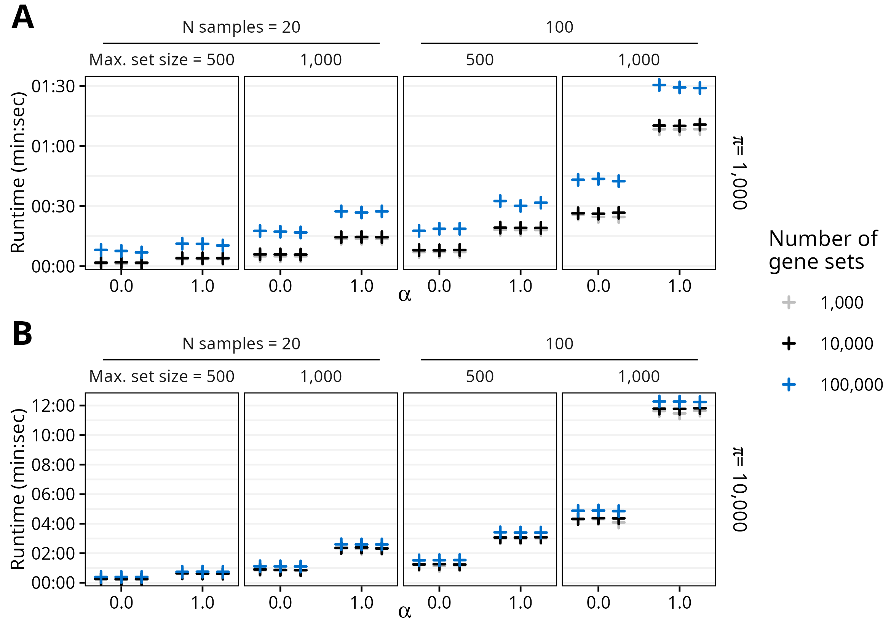

```{r include=FALSE}
knitr::opts_chunk$set(
   fig.align = 'center', 
   fig.height = 5.55, 
   fig.width = 7.8, 
   dpi = 300
)
```

# fast.ssgsea

<!-- badges: start -->
<!-- badges: end -->

`fast.ssgsea` is an R package [@R-core-team] for fast Single-Sample Gene Set Enrichment Analysis (ssGSEA) and Post-Translational Modification Signature Enrichment Analysis (PTM-SEA) [@barbie-systematic-2009; @krug-curated-2019].


## Installation

In R (>= 4.0.0), run the following to install.

``` r
if (!require("devtools", quietly = TRUE))
   install.packages("devtools")

devtools::install_github("PNNL-Comp-Mass-Spec/fast.ssgsea")
```

## Usage 

The package consists of a single user-facing function, `fast_ssgsea`, that accepts a numeric matrix with genes or other molecules as rows and either samples, contrasts, or some other meaningful representation of the data as columns. A named list of gene sets (more generally, molecular signatures) is also required. Other arguments control the behavior of ssGSEA/PTM-SEA, and they are described in the function documentation.

### Simulate Data

We will simulate a matrix with 10,000 genes as rows and 100 samples as columns. Then, we generate 20,000 gene sets by randomly sampling between 10 and 500 genes from the matrix row names.

```{r simulate-data}
n_genes <- 10000L # number of genes
n_samples <- 100L # number of samples
genes <- paste0("gene", seq_len(n_genes))
samples <- paste0("sample", seq_len(n_samples))

## Simulate matrix of sample gene expression values
set.seed(9001L)
X <- matrix(data = rnorm(n = n_genes * n_samples),
            nrow = n_genes,
            ncol = n_samples,
            dimnames = list(genes, samples))

## Simulate list of gene sets
n_sets <- 20000L # number of gene sets
min_size <- 10L # size of smallest gene set
max_size <- 500L # size of largest gene set

size_range <- max_size - min_size + 1L
n_reps <- ceiling(n_sets / size_range)
set_sizes <- rep(max_size:min_size, times = n_reps)[seq_len(n_sets)]

gene_sets <- lapply(seq_len(n_sets), function(i) {
   set.seed(i)
   sample(x = genes, size = set_sizes[i])
})
names(gene_sets) <- paste0("set", seq_along(gene_sets))
```

### Results

This shows the runtime of `fast_ssgsea` with the reference BLAS library (single-threaded) running on an AMD Ryzen 5 7600X CPU (5.3 GHz clock speed).

```{r time-results}
library(fast.ssgsea)

# Runtime (elapsed time)
system.time({
   res <- fast_ssgsea(
      X = X,
      gene_sets = gene_sets,
      alpha = 1,
      nperm = 1000L,
      batch_size = 1000L,
      adjust_globally = FALSE,
      min_size = min_size,
      sort = TRUE,
      seed = 0L
   )
})

str(res)
```

### Session Information

```{r session-info}
print(sessionInfo(), locale = FALSE, tzone = FALSE)
```


## Performance

The `fast.ssgsea` R package utilizes linear algebra and ideas from Fast Gene Set Enrichment Analysis [@korotkevich-fast-2021] to greatly reduce the runtime of ssGSEA and PTM-SEA while also properly controlling the type I error rate.

Tests were performed on a desktop computer with an AMD Ryzen 5 7600X CPU (6 cores, 12 threads) at 5.3 GHz. Different combinations of the number of samples, gene sets, maximum gene set size, number of permutations, and value of the $\alpha$ parameter (the weighting exponent) were tested in a random order (3 replicates each) to minimize the influence of previous runs.

```{r, echo=FALSE}
fig1_cap <- "Runtime of fast_ssgsea with A) 1,000 or B) 10,000 permutations. R was linked to the default reference BLAS library, so only a single thread was used."

fig2_cap <- "Runtime of fast_ssgsea with A) 1,000 or B) 10,000 permutations. R was linked to the optimized OpenBLAS library, and all 12 threads were used."
```


```{r, echo=FALSE, fig.cap=fig1_cap}

```

## Optimized BLAS Library

Linking R to an optimized Basic Linear Algebra Subprograms (BLAS) library [@blas], such as the open-source OpenBLAS library [@openblas-1; @openblas-2], can reduce the runtime even further:

```{r, echo=FALSE, fig.cap=fig2_cap}
knitr::include_graphics("./man/figures/README-figure-2.png")
```


# References
