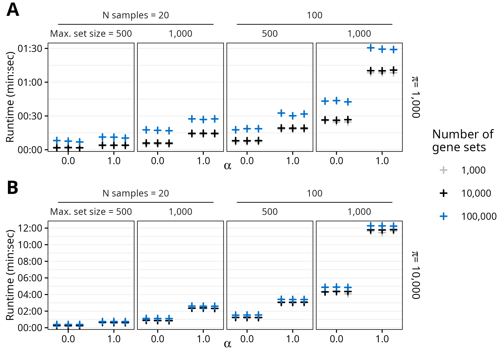
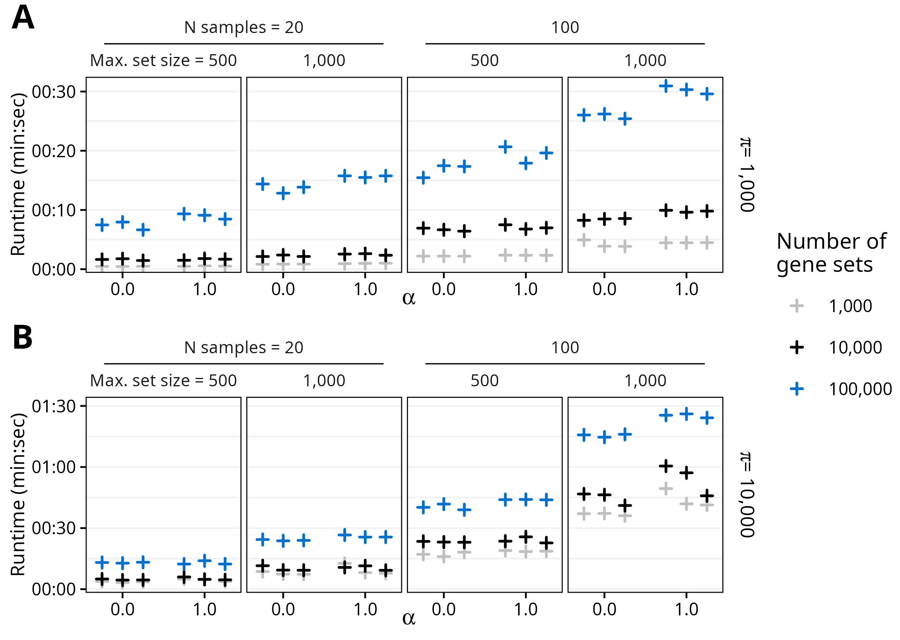

# fast.ssgsea

<!-- badges: start -->

<!-- badges: end -->

`fast.ssgsea` is an R package ([R Core Team 2024](#ref-R-core-team)) for
fast Single-Sample Gene Set Enrichment Analysis (ssGSEA) and
Post-Translational Modification Signature Enrichment Analysis (PTM-SEA)
([Barbie et al. 2009](#ref-barbie-systematic-2009); [Krug et al.
2019](#ref-krug-curated-2019)).

## Installation

In R (\>= 4.0.0), run the following to install.

``` r
if (!require("devtools", quietly = TRUE))
   install.packages("devtools")

devtools::install_github("PNNL-Comp-Mass-Spec/fast.ssgsea")
```

## Usage

The package consists of a single user-facing function, `fast_ssgsea`,
that accepts a numeric matrix with genes or other molecules as rows and
either samples, contrasts, or some other meaningful representation of
the data as columns. A named list of gene sets (more generally,
molecular signatures) is also required. Other arguments control the
behavior of ssGSEA/PTM-SEA, and they are described in the function
documentation.

### Simulate Data

We will simulate a matrix with 10,000 genes as rows and 100 samples as
columns. Then, we generate 20,000 gene sets by randomly sampling between
10 and 500 genes from the matrix row names.

``` r
n_genes <- 10000L # number of genes
n_samples <- 100L # number of samples
genes <- paste0("gene", seq_len(n_genes))
samples <- paste0("sample", seq_len(n_samples))

## Simulate matrix of sample gene expression values
set.seed(9001L)
X <- matrix(data = rnorm(n = n_genes * n_samples),
            nrow = n_genes,
            ncol = n_samples,
            dimnames = list(genes, samples))

## Simulate list of gene sets
n_sets <- 20000L # number of gene sets
min_size <- 10L # size of smallest gene set
max_size <- 500L # size of largest gene set

size_range <- max_size - min_size + 1L
n_reps <- ceiling(n_sets / size_range)
set_sizes <- rep(max_size:min_size, times = n_reps)[seq_len(n_sets)]

gene_sets <- lapply(seq_len(n_sets), function(i) {
   set.seed(i)
   sample(x = genes, size = set_sizes[i])
})
names(gene_sets) <- paste0("set", seq_along(gene_sets))
```

### Results

This shows the runtime of `fast_ssgsea` with the reference BLAS library
(single-threaded) running on an AMD Ryzen 5 7600X CPU (5.3 GHz clock
speed).

``` r
library(fast.ssgsea)

# Runtime (elapsed time)
system.time({
   res <- fast_ssgsea(
      X = X,
      gene_sets = gene_sets,
      alpha = 1,
      nperm = 1000L,
      batch_size = 1000L,
      adjust_globally = FALSE,
      min_size = min_size,
      sort = TRUE,
      seed = 0L
   )
})
```

    ##    user  system elapsed 
    ##  25.838   0.450  21.669

``` r
str(res)
```

    ## 'data.frame':    2000000 obs. of  9 variables:
    ##  $ sample      : Factor w/ 100 levels "sample1","sample2",..: 1 1 1 1 1 1 1 1 1 1 ...
    ##  $ set         : chr  "set3049" "set2620" "set8425" "set16760" ...
    ##  $ set_size    : int  398 336 423 435 391 301 301 458 440 454 ...
    ##  $ ES          : num  948 968 870 842 848 ...
    ##  $ NES         : num  4.41 4.09 4.13 4.14 3.89 ...
    ##  $ n_same_sign : int  543 539 539 537 536 535 535 533 533 530 ...
    ##  $ n_as_extreme: int  0 0 0 0 0 0 0 0 0 0 ...
    ##  $ p_value     : num  0.00184 0.00185 0.00185 0.00186 0.00186 ...
    ##  $ adj_p_value : num  0.796 0.796 0.796 0.796 0.796 ...

### Session Information

``` r
print(sessionInfo(), locale = FALSE, tzone = FALSE)
```

    ## R version 4.5.1 (2025-06-13)
    ## Platform: x86_64-pc-linux-gnu
    ## Running under: Linux Mint 22.1
    ## 
    ## Matrix products: default
    ## BLAS:   /usr/lib/x86_64-linux-gnu/blas/libblas.so.3.12.0 
    ## LAPACK: /usr/lib/x86_64-linux-gnu/lapack/liblapack.so.3.12.0  LAPACK version 3.12.0
    ## 
    ## attached base packages:
    ## [1] stats     graphics  grDevices utils     datasets  methods   base     
    ## 
    ## other attached packages:
    ## [1] fast.ssgsea_0.1.0
    ## 
    ## loaded via a namespace (and not attached):
    ##  [1] dqrng_0.4.1            digest_0.6.37          RcppArmadillo_14.6.0-1
    ##  [4] fastmap_1.2.0          xfun_0.52              Matrix_1.7-3          
    ##  [7] lattice_0.22-7         knitr_1.50             htmltools_0.5.8.1     
    ## [10] rmarkdown_2.29         cli_3.6.5              grid_4.5.1            
    ## [13] data.table_1.17.8      compiler_4.5.1         rstudioapi_0.17.1     
    ## [16] tools_4.5.1            evaluate_1.0.4         Rcpp_1.1.0            
    ## [19] yaml_2.3.10            rlang_1.1.6

## Performance

The `fast.ssgsea` R package utilizes linear algebra and ideas from Fast
Gene Set Enrichment Analysis ([Korotkevich et al.
2021](#ref-korotkevich-fast-2021)) to greatly reduce the runtime of
ssGSEA and PTM-SEA while also properly controlling the type I error
rate.

Tests were performed on a desktop computer with an AMD Ryzen 5 7600X CPU
(6 cores, 12 threads) at 5.3 GHz. Different combinations of the number
of samples, gene sets, maximum gene set size, number of permutations,
and value of the $\alpha$ parameter (the weighting exponent) were tested
in a random order (3 replicates each) to minimize the influence of
previous runs.

<div class="figure" style="text-align: center">


<p class="caption">

Runtime of fast_ssgsea with A) 1,000 or B) 10,000 permutations. R was
linked to the default reference BLAS library, so only a single thread
was used.
</p>

</div>

## Optimized BLAS Library

Linking R to an optimized Basic Linear Algebra Subprograms (BLAS)
library ([Lawson et al. 1979](#ref-blas)), such as the open-source
OpenBLAS library ([Xianyi, Qian, and Yunquan 2012](#ref-openblas-1);
[Wang et al. 2013](#ref-openblas-2)), can reduce the runtime even
further:

<div class="figure" style="text-align: center">


<p class="caption">

Runtime of fast_ssgsea with A) 1,000 or B) 10,000 permutations. R was
linked to the optimized OpenBLAS library, and all 12 threads were used.
</p>

</div>

# References

<div id="refs" class="references csl-bib-body hanging-indent"
entry-spacing="0">

<div id="ref-barbie-systematic-2009" class="csl-entry">

Barbie, David A., Pablo Tamayo, Jesse S. Boehm, So Young Kim, Susan E.
Moody, Ian F. Dunn, Anna C. Schinzel, et al. 2009. “Systematic RNA
Interference Reveals That Oncogenic KRAS-Driven Cancers Require TBK1.”
*Nature* 462 (7269): 108–12. <https://doi.org/10.1038/nature08460>.

</div>

<div id="ref-korotkevich-fast-2021" class="csl-entry">

Korotkevich, Gennady, Vladimir Sukhov, Nikolay Budin, Boris Shpak, Maxim
N. Artyomov, and Alexey Sergushichev. 2021. “Fast Gene Set Enrichment
Analysis.” bioRxiv. <https://doi.org/10.1101/060012>.

</div>

<div id="ref-krug-curated-2019" class="csl-entry">

Krug, Karsten, Philipp Mertins, Bin Zhang, Peter Hornbeck, Rajesh Raju,
Rushdy Ahmad, Matthew Szucs, et al. 2019. “A Curated Resource for
Phosphosite-Specific Signature Analysis.” *Molecular & Cellular
Proteomics* 18 (3): 576–93. <https://doi.org/10.1074/mcp.TIR118.000943>.

</div>

<div id="ref-blas" class="csl-entry">

Lawson, C. L., R. J. Hanson, D. R. Kincaid, and F. T. Krogh. 1979.
“Basic Linear Algebra Subprograms for Fortran Usage.” *ACM Trans. Math.
Softw.* 5 (3): 308–23. <https://doi.org/10.1145/355841.355847>.

</div>

<div id="ref-R-core-team" class="csl-entry">

R Core Team. 2024. *R: A Language and Environment for Statistical
Computing*. Vienna, Austria: R Foundation for Statistical Computing.
<https://www.R-project.org/>.

</div>

<div id="ref-openblas-2" class="csl-entry">

Wang, Qian, Xianyi Zhang, Yunquan Zhang, and Qing Yi. 2013. “AUGEM:
Automatically Generate High Performance Dense Linear Algebra Kernels on
X86 CPUs.” In *Proceedings of the International Conference on High
Performance Computing, Networking, Storage and Analysis*. SC ’13. New
York, NY, USA: Association for Computing Machinery.
<https://doi.org/10.1145/2503210.2503219>.

</div>

<div id="ref-openblas-1" class="csl-entry">

Xianyi, Zhang, Wang Qian, and Zhang Yunquan. 2012. “Model-Driven Level 3
BLAS Performance Optimization on Loongson 3A Processor.” In *2012 IEEE
18th International Conference on Parallel and Distributed Systems*,
684–91. <https://doi.org/10.1109/ICPADS.2012.97>.

</div>

</div>
